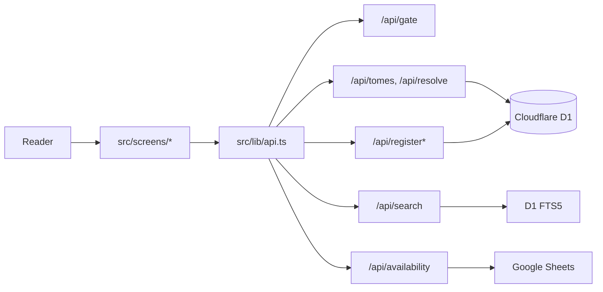

# Architecture

See the root [Codex project brief](../codex.md) for the complete project and API reference. This note holds the navigable system map.

## Request path

1. `src/main.ts` builds the shared chrome and mounts the hash router.
2. `src/lib/router.ts` selects the insert screen or catalogue screen.
3. Screens call typed wrappers in `src/lib/api.ts`.
4. Cloudflare Pages Functions in `functions/api/` handle same-origin API requests. `_middleware.ts` admits only valid signed-writ requests except for `/api/gate`.
5. D1 (`DB`) stores the catalogue and visit tally; FTS5 handles full-text search. The availability service reads the College register from Google Sheets.

## Source map

- Browser entry and composition: `src/main.ts`
- Hash routing: `src/lib/router.ts`
- Typed API boundary: `src/lib/api.ts`
- Screens: `src/screens/insert.ts`, `src/screens/catalogue.ts`
- Shared shelf/date logic: `shared/`
- API handlers and gate middleware: `functions/api/`
- Sheets and register logic: `functions/lib/availability.ts`, `functions/lib/register.ts`
- Gate cookie logic: `functions/lib/gate.ts`
- SQL history: `migrations/`
- Library content and metadata: `content/`
- Wrangler D1 binding and Pages output: `wrangler.toml`

The external diagram supplied by the user is useful as a conceptual system map. The checked-in source is authoritative for current implementation details; recheck routes and contracts before making changes.
